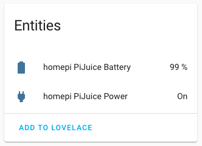

# PiJuice MQTT
 Publish PiJuice UPS information to MQTT for consumption by, for example, Node-RED and Home Assistant

The [PiJuice UPS hats by PiSupply](https://uk.pi-supply.com/products/pijuice-standard) make very nice battery backups for Raspberry Pi's. I use mine so that Home Assistant (HA) continues to run during [Loadshedding in South Africa](https://en.wikipedia.org/wiki/South_African_energy_crisis), and to correctly shut down the Pi when the battery runs low.

Existing [Node-RED](https://flows.nodered.org/node/node-red-contrib-pisupply-pijuice-pis0212) and HA integrations assume Node-RED and HA are running on the same Pi that has the PiJuice. This doesn't work when running in Docker Swarm mode (as I do). I wanted a service that runs on each Pi and publishes PiJuice stats to MQTT. From there I can monitor battery level, and start automations when the Pi loses or regains wall power.


## Installation

### Install the PiJuice CLI
This installation assumes that you already have the [`pijuice_cli`](https://github.com/PiSupply/PiJuice/tree/master/Software#pijuice-cli) working. To test this, on your command line type `pijuice_cli` and you should be presented with the PiJuice CLI. If you are not, follow the [Installation Guide](https://github.com/PiSupply/PiJuice/tree/master/Software#pijuice-software).

### Clone this repo

1. Either clone or download this repo into a folder on your Pi `git clone git@github.com:dalehumby/PiJuice-MQTT.git`
2. Open the folder `cd PiJuice-MQTT`
3. Rename the config file `mv config.yaml.example config.yaml`
4. Open the `config.yaml` file and change the MQTT broker IP/hostname and the broker username/password. If no username/password is required to use your broker then delete the `username` and `password` lines
5. Add the required libraries `pip install -r requirements.txt`
6. To test the code is working, on the command line enter `python3 pijuicemqtt.py`. You should not see any errors or stack traces

## MQTT

Every 30 seconds the script published to the topic `pijuicemqtt/<yourpihostname>/status`, typically `pijuicemqtt/raspberrypi/status` if you use the default hostname on your Pi.

Example payload:

```json
{
  "batteryCharge": 99,
  "batteryVolage": 4.161,
  "batteryCurrent": -0.427,
  "batteryTemperature": 47,
  "batteryStatus": "NORMAL",
  "powerInput": "NOT_PRESENT",
  "powerInput5vIo": "PRESENT",
  "ioVoltage": 5.123,
  "ioCurrent": 0.21
}
```

The titles and values come directly from the PiJuice Python library and are unaltered, except for changing mA and mV to A and V. For details see PiSupply's [I2C Command API](https://github.com/PiSupply/PiJuice/tree/master/Software#i2c-command-api) and their [Python code](https://github.com/PiSupply/PiJuice/blob/master/Software/Source/pijuice.py).

Briefly:
- `batteryCharge` is percent 0 to 100 %
- `batteryVoltage` is typically 3.2 V min and 4.2 V max
- `batteryCurrent` is the charging/discharge of the battery. Negative means in to the battery
- `batteryTemperature` in degrees Celsius
- `batteryStatus` where `NORMAL` is fully charged with no errors, **TODO other values for charging**
- `powerInput` will be `PRESENT` if USB is plugged into the PiJuice hat
- `powerInput5vIo` will be `PRESENT` if USB is plugged into the Raspberry Pi board (as it is here), and the PiJuice is getting power via the headers on the Pi
- `ioVoltage` is the Pi's 5 V rail. Should be 5.0 V to max 5.25 V
- `ioCurrent` is current flowing to/from the Raspberry Pi. Negative means from the PiJuice to Pi; Positive from the Pi to PiJuice

The stats above show that the battery is fully charged, and the boards are powered via the USB connector on the Raspberry Pi. There are no errors and all voltages look good.

## Home Assistant

To automatically add the PiJuice device and entities to Home Assistant, in `config.yaml` set the `homeassistant` `topic` and `sensor: true`. (You will also need the [MQTT Integration](https://www.home-assistant.io/integrations/mqtt/) setup in Home Assistant.)

A device called `<youpihostname> PiJuice` will be added to the device registry, along with two entities:
- `<youpihostname> PiJuice Battery` battery charge percentage as a `sensor`
- `<youpihostname> PiJuice PowerInput5vIo` status of the 5 V IO power input as a `binary_sensor`, where `off` means no power, and `on` means wall power is present

All information from the MQTT payload is added as an `attribute` to the sensors so you can get more detailed info like voltages and currents, if you need them.



You can then add show this information on your Lovelace dashboards, add badges and automations.

### Install as a systemd service

To run `pijuicemqtt.py` as a background service on the Pi:

1. Create the service file `sudo cp pijuicemqtt.service /lib/systemd/system/pijuicemqtt.service` 
2. Open the service file `sudo nano /lib/systemd/system/pijuicemqtt.service` 
3. Change the paths in `WorkingDirectory` and `ExecStart` to the location  of `pijuicemqtt.py`. Also check the `python` path is correct. Save and exit

Then on the command line:

1. `sudo systemctl daemon-reload`
2. `sudo systemctl enable pijuicemqtt.service`
3. `sudo systemctl start pijuicemqtt.service`
4. `sudo systemctl status pijuicemqtt.service`

You should see something like:

```
● pijuicemqtt.service - PiJuice to MQTT
   Loaded: loaded (/lib/systemd/system/pijuicemqtt.service; enabled; vendor preset: enabled)
   Active: active (running) since Sun 2021-06-06 09:03:24 UTC; 4s ago
 Main PID: 1548 (python3)
    Tasks: 2 (limit: 4915)
   CGroup: /system.slice/pijuicemqtt.service
           └─1548 /usr/bin/python3 /media/cluster/config/PiJuice-MQTT/pijuicemqtt.py

Jun 06 09:03:24 homepi systemd[1]: Started PiJuice to MQTT.
```

The background service is now running and will continue to publish to MQTT every 30 seconds. The script will restart if it crashes, and after Pi restart. 

You can stop the script by `sudo systemctl stop pijuicemqtt.service`

## Other resources

- [Publish Eskom loadshedding stage and schedule to MQTT using Node-RED](https://github.com/dalehumby/Eskom-Loadshedding-NodeRED)
